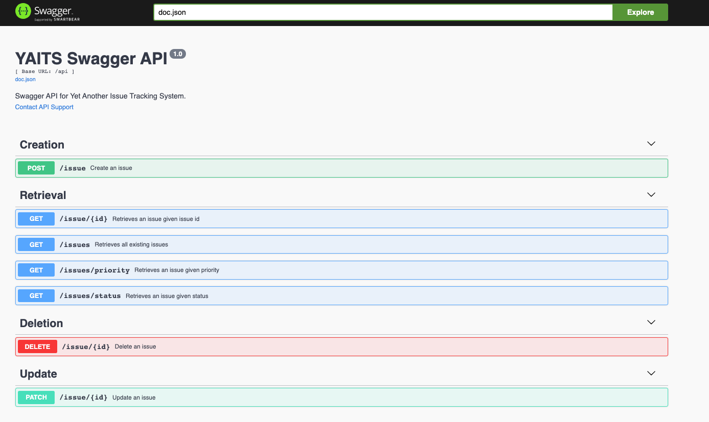

# YAITS  

Yet Another Issue Tracking System (YAITS) is a Go Modules project that gives APIs to create, update, retrieve, and delete issues.

## Setup
The project can be run with docker 
1. From YAITS/mysql run `docker-compose up --build`
(if running with docker the db host conf should be matching the mysql container name in this case `db`)
2. This will spawn a mysql container exposed at :3306 and the api exposed at :8080 (with the volume mounted on)

## Testing
1. `git clone https://github.com/Scieon/YAITS.git`
2. `go test ./...`

## Swagger Docs
This project supports swagger annotations to generate API documentation
* To generate or update docs use `swag init` from `YAITS/api/`
* Docs are accessible at /api/swagger/index.html (http://localhost:8080/api/swagger/index.html)

